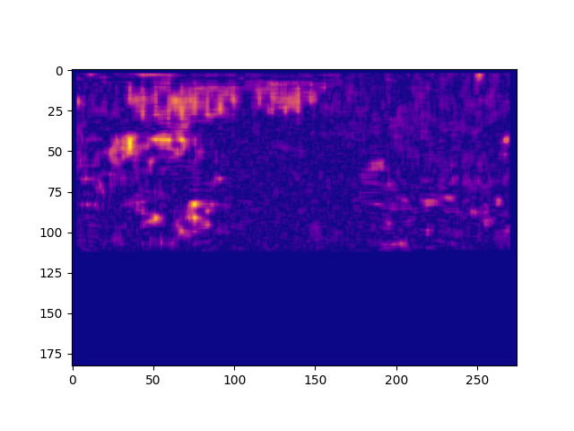
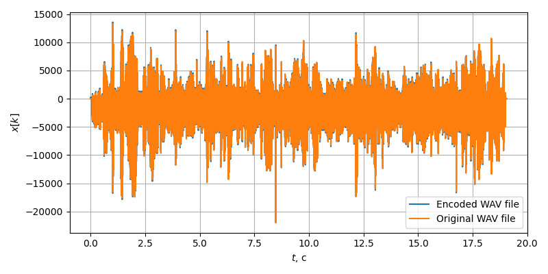

## CyberSecurity Project ##

### This is a python application ###
- It can encode a secret message in video (currently supported format is `.mov`)
- Then you can share this video with anyone
- After that one can decode that secret message to get a secret information
- The secret information is stored both in frames and in audio. (It is
duplicated to make verifying trivial).
- Currently only LSB (last significan bit) algorithm is implemented both in
frames and in audio
- There is a possibility to generate audio visualization and entropy plots to see the way secret info is encoded.

### How to use it? ###
- To clone this project, run this:
```
        git clone https://github.com/kefirRzevo/CybersecurityProject.git
        cd CybersecurityProject
```
- To install all python deps:
```
    pip install -r requirements.txt
```
- To see all enabled modes:
```
    ./src/main.py --help
```
After that select mode (encode,decode,plot_picture,plot_video,plot_audio) and run `src/main.py` with necessary options.

### This is an example of frame steganography



### This is an example of audio steganography

